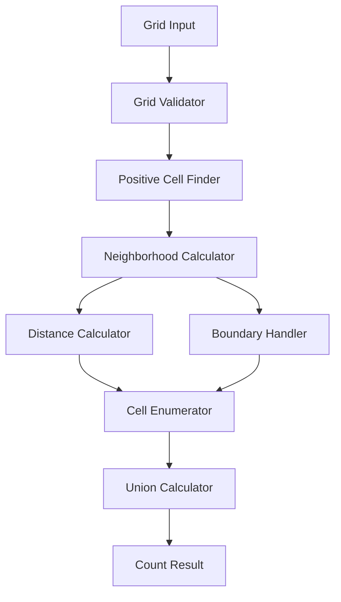

# Design Document: Grid Cell Neighborhoods

## Overview

The Grid Cell Neighborhoods system implements an algorithm to count unique cells within Manhattan distance neighborhoods of positive-valued cells in a 2D grid. The system processes grids of arbitrary dimensions, identifies positive cells, calculates Manhattan distance neighborhoods, and returns the total count of unique cells within those neighborhoods.

The core challenge is efficiently computing the union of potentially overlapping diamond-shaped neighborhoods while respecting grid boundaries. The solution uses coordinate-based algorithms to enumerate neighborhood cells and set-based operations to ensure uniqueness.

## Architecture

The system follows a modular architecture with clear separation of concerns:



**Core Components:**
- **Grid Validator**: Validates grid dimensions and cell positions
- **Positive Cell Finder**: Identifies cells with values > 0
- **Distance Calculator**: Computes Manhattan distances between cells
- **Neighborhood Calculator**: Orchestrates neighborhood enumeration
- **Boundary Handler**: Ensures cells remain within grid bounds
- **Cell Enumerator**: Generates all cells within distance threshold
- **Union Calculator**: Combines overlapping neighborhoods without duplication

## Components and Interfaces

### Grid Interface
```
interface Grid {
    height: Integer
    width: Integer
    getPositiveCells(): List<Position>
    isValidPosition(position: Position): Boolean
}
```

### Position Interface
```
interface Position {
    row: Integer
    column: Integer
    manhattanDistance(other: Position): Integer
}
```

### NeighborhoodCalculator Interface
```
interface NeighborhoodCalculator {
    countNeighborhoodCells(grid: Grid, distanceThreshold: Integer): Integer
    getNeighborhoodCells(grid: Grid, distanceThreshold: Integer): Set<Position>
}
```

### DistanceCalculator Interface
```
interface DistanceCalculator {
    calculateManhattanDistance(pos1: Position, pos2: Position): Integer
}
```

### BoundaryHandler Interface
```
interface BoundaryHandler {
    isWithinBounds(position: Position, grid: Grid): Boolean
    filterValidPositions(positions: Set<Position>, grid: Grid): Set<Position>
}
```

## Data Models

### Grid Model
```
class Grid {
    height: Integer (> 0)
    width: Integer (> 0)
    cells: Array[height][width] of Integer
    
    invariants:
        - height > 0
        - width > 0
        - cells.length == height
        - cells[i].length == width for all i
}
```

### Position Model
```
class Position {
    row: Integer (>= 0)
    column: Integer (>= 0)
    
    invariants:
        - row >= 0
        - column >= 0
}
```

### NeighborhoodResult Model
```
class NeighborhoodResult {
    totalCount: Integer (>= 0)
    cells: Set<Position>
    
    invariants:
        - totalCount == cells.size()
        - totalCount >= 0
}
```

## Algorithm Design

### Core Algorithm: Diamond Enumeration

For each positive cell at position (r, c) with distance threshold N, enumerate all cells within Manhattan distance N:

```
function enumerateNeighborhood(centerRow, centerCol, N):
    neighborhood = empty set
    for deltaRow from -N to N:
        remainingDistance = N - abs(deltaRow)
        for deltaCol from -remainingDistance to remainingDistance:
            candidateRow = centerRow + deltaRow
            candidateCol = centerCol + deltaCol
            if isValidPosition(candidateRow, candidateCol):
                neighborhood.add((candidateRow, candidateCol))
    return neighborhood
```

### Union Calculation

```
function calculateTotalNeighborhood(grid, distanceThreshold):
    allCells = empty set
    positiveCells = findPositiveCells(grid)
    
    for each positiveCell in positiveCells:
        neighborhood = enumerateNeighborhood(positiveCell.row, positiveCell.col, distanceThreshold)
        allCells = allCells union neighborhood
    
    return allCells.size()
```

### Optimization Strategies

1. **Early Termination**: When distance threshold exceeds grid dimensions, count all grid cells
2. **Boundary Pre-filtering**: Skip enumeration outside grid bounds
3. **Set Operations**: Use efficient set data structures for union operations
4. **Diamond Shape**: Leverage Manhattan distance diamond geometry for efficient enumeration

## Correctness Properties

*A property is a characteristic or behavior that should hold true across all valid executions of a system—essentially, a formal statement about what the system should do. Properties serve as the bridge between human-readable specifications and machine-verifiable correctness guarantees.*

### Property 1: Grid Validation
*For any* height and width values, grid creation should succeed if and only if both height > 0 and width > 0, and all specified positive cell positions should be within the resulting grid boundaries
**Validates: Requirements 1.1, 1.2**

### Property 2: Manhattan Distance Calculation
*For any* two positions in a coordinate system, the Manhattan distance should equal |row1 - row2| + |column1 - column2|, always return a non-negative integer, and return 0 when both positions are identical
**Validates: Requirements 2.1, 2.2, 2.3**

### Property 3: Coordinate System Consistency
*For any* grid dimensions, position (0,0) should consistently represent the bottom-left corner, and stored positive cell positions should be retrievable for neighborhood calculations
**Validates: Requirements 1.3, 1.4**

### Property 4: Self-Inclusion in Neighborhoods
*For any* positive cell at any valid position, that cell should always be included in its own neighborhood count regardless of distance threshold (when N >= 0)
**Validates: Requirements 3.1**

### Property 5: Complete Neighborhood Enumeration
*For any* positive cell positioned away from grid boundaries, the neighborhood should include all cells within N Manhattan steps when the full diamond fits within the grid
**Validates: Requirements 3.2**

### Property 6: Boundary Constraint Enforcement
*For any* positive cell and distance threshold, the neighborhood count should exclude all cells that would fall outside the grid boundaries, with no wraparound behavior
**Validates: Requirements 3.3, 6.1, 6.2, 6.3**

### Property 7: Cell Uniqueness Guarantee
*For any* grid configuration with positive cells, each cell should be counted at most once in the total neighborhood count, regardless of how many positive cell neighborhoods it falls within
**Validates: Requirements 3.4, 4.2, 5.1**

### Property 8: Non-Overlapping Additivity
*For any* set of positive cells whose neighborhoods do not overlap, the total neighborhood count should equal the sum of individual neighborhood counts
**Validates: Requirements 4.1, 4.3**

### Property 9: Overlapping Union Behavior
*For any* set of positive cells with overlapping neighborhoods, the total count should equal the size of the union of all neighborhoods and be less than or equal to the sum of individual neighborhood counts
**Validates: Requirements 5.2, 5.3**

### Property 10: Zero Distance Threshold
*For any* grid with positive cells, when distance threshold N = 0, the neighborhood count should equal exactly the number of positive cells
**Validates: Requirements 7.2**

### Property 11: Maximum Distance Threshold
*For any* grid and distance threshold N that exceeds the grid's maximum possible Manhattan distance, the neighborhood count should equal the total number of grid cells when positive cells exist
**Validates: Requirements 7.3**

### Property 12: Degenerate Grid Handling
*For any* grid with unusual dimensions (1×N, N×1, 1×1), neighborhood calculations should produce mathematically correct results consistent with the Manhattan distance definition
**Validates: Requirements 7.4**

### Property 13: Cross-Language Result Consistency
*For any* identical grid configuration, positive cell positions, and distance threshold, all programming language implementations should produce identical neighborhood counts
**Validates: Requirements 9.1, 9.3, 9.4**

## Error Handling

### Input Validation Errors
- **Invalid Grid Dimensions**: Throw `InvalidGridDimensionsException` when height <= 0 or width <= 0
- **Out of Bounds Positions**: Throw `PositionOutOfBoundsException` when positive cell positions exceed grid boundaries
- **Negative Distance Threshold**: Throw `InvalidDistanceThresholdException` when N < 0

### Runtime Errors
- **Memory Constraints**: Handle large grid calculations gracefully with appropriate memory management
- **Overflow Protection**: Ensure integer calculations don't overflow for large grids or distance thresholds

### Error Recovery
- **Graceful Degradation**: For performance-critical applications, provide options to limit calculation scope
- **Validation Feedback**: Provide clear error messages indicating which validation rules were violated

## Testing Strategy

### Dual Testing Approach

The system requires both unit testing and property-based testing for comprehensive coverage:

**Unit Tests** focus on:
- Specific examples from the BDD scenarios (26 concrete test cases)
- Edge cases like empty grids, single cells, corner positions
- Error conditions and input validation
- Integration between components

**Property-Based Tests** focus on:
- Universal properties that hold across all valid inputs
- Comprehensive input coverage through randomization
- Mathematical invariants and relationships
- Cross-language consistency validation

### Property-Based Testing Configuration

- **Testing Framework**: Use language-appropriate PBT libraries (QuickCheck for Haskell, Hypothesis for Python, fast-check for JavaScript/TypeScript, etc.)
- **Test Iterations**: Minimum 100 iterations per property test
- **Test Tagging**: Each property test must reference its design document property using the format:
  - **Feature: grid-neighborhoods, Property {number}: {property_text}**
- **Generator Strategy**: Create smart generators that:
  - Generate valid grid dimensions (1 to reasonable maximum)
  - Generate valid positions within grid boundaries
  - Generate meaningful distance thresholds (0 to grid diagonal + buffer)
  - Create both overlapping and non-overlapping positive cell configurations

### Test Coverage Requirements

1. **All BDD Scenarios**: Each of the 26 scenarios must have corresponding unit tests
2. **All Properties**: Each of the 13 correctness properties must have property-based tests
3. **Error Conditions**: All validation and error handling paths must be tested
4. **Cross-Language**: Identical test suites must be implemented in each target language

### Performance Testing

While not part of correctness properties, performance characteristics should be validated:
- Large grid handling (up to 1000×1000 grids)
- High distance thresholds (N > max(height, width))
- Multiple positive cells (up to 10% of grid cells)
- Degenerate cases (1×N, N×1 grids with large N)